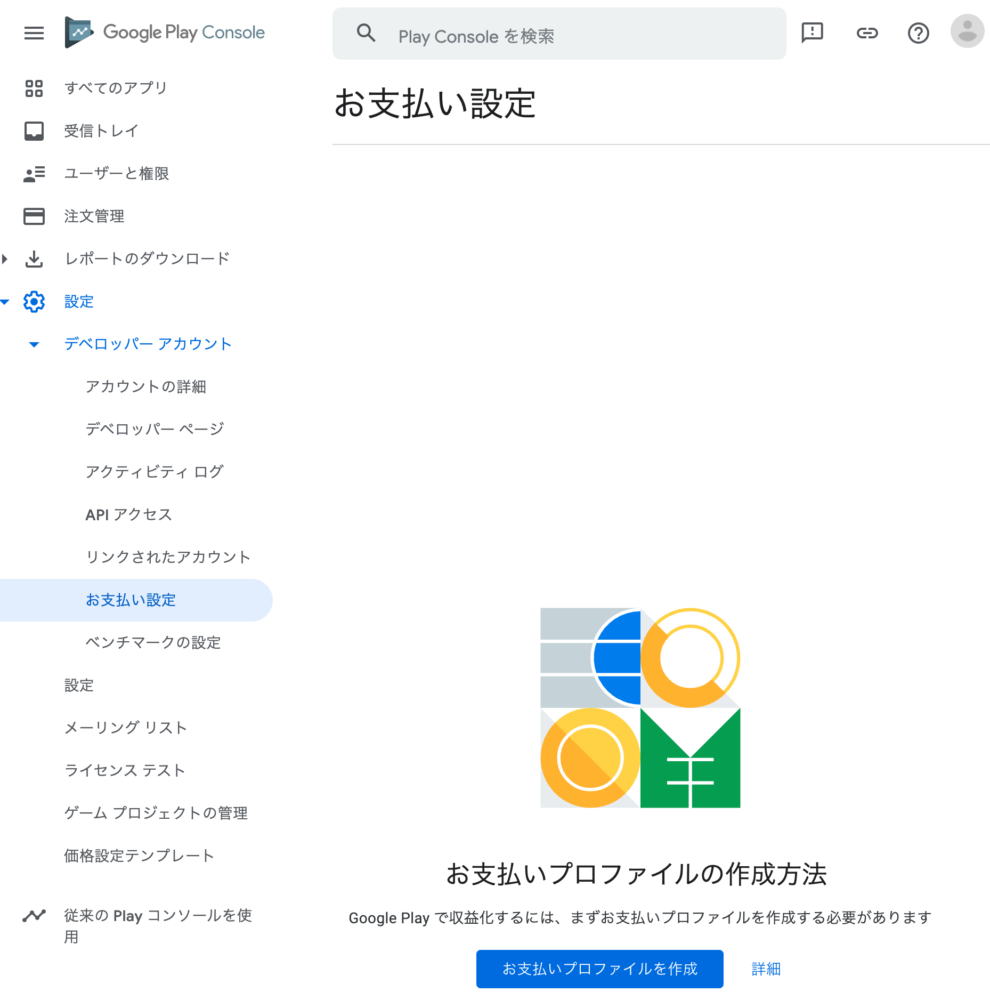
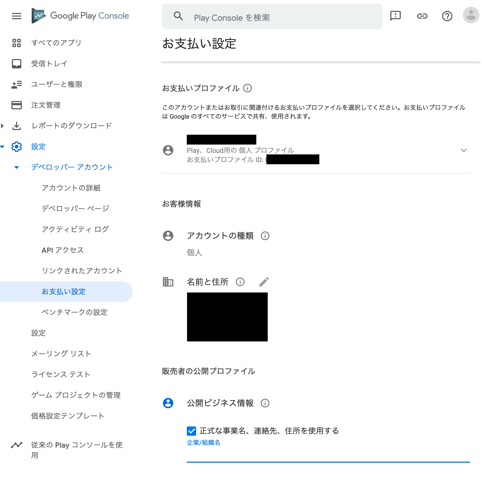
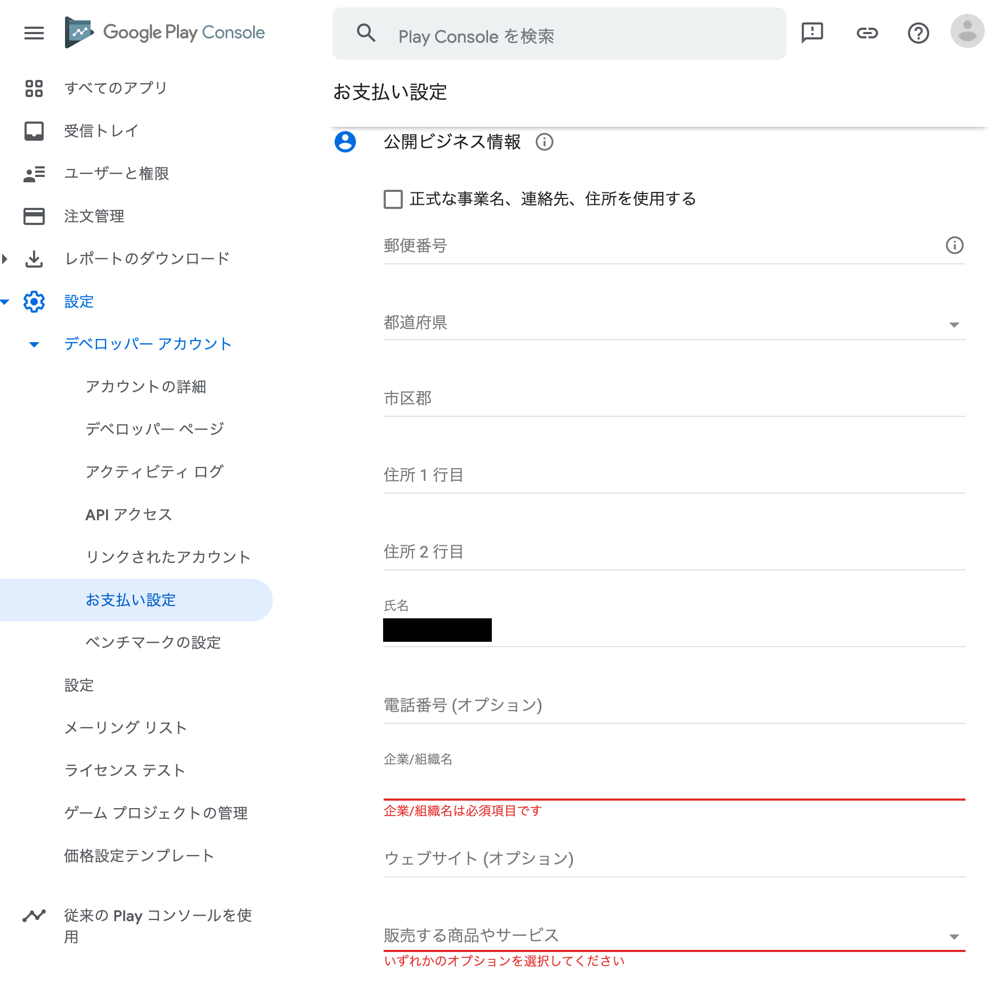
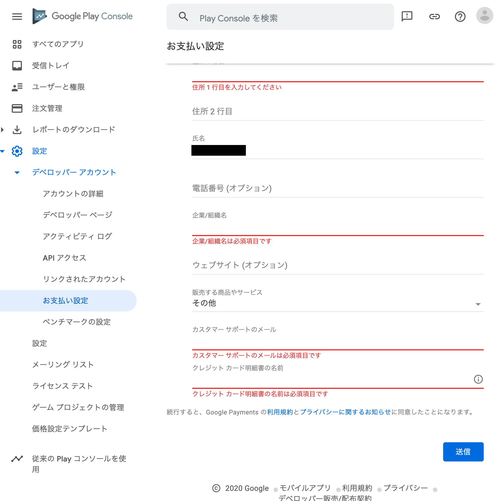
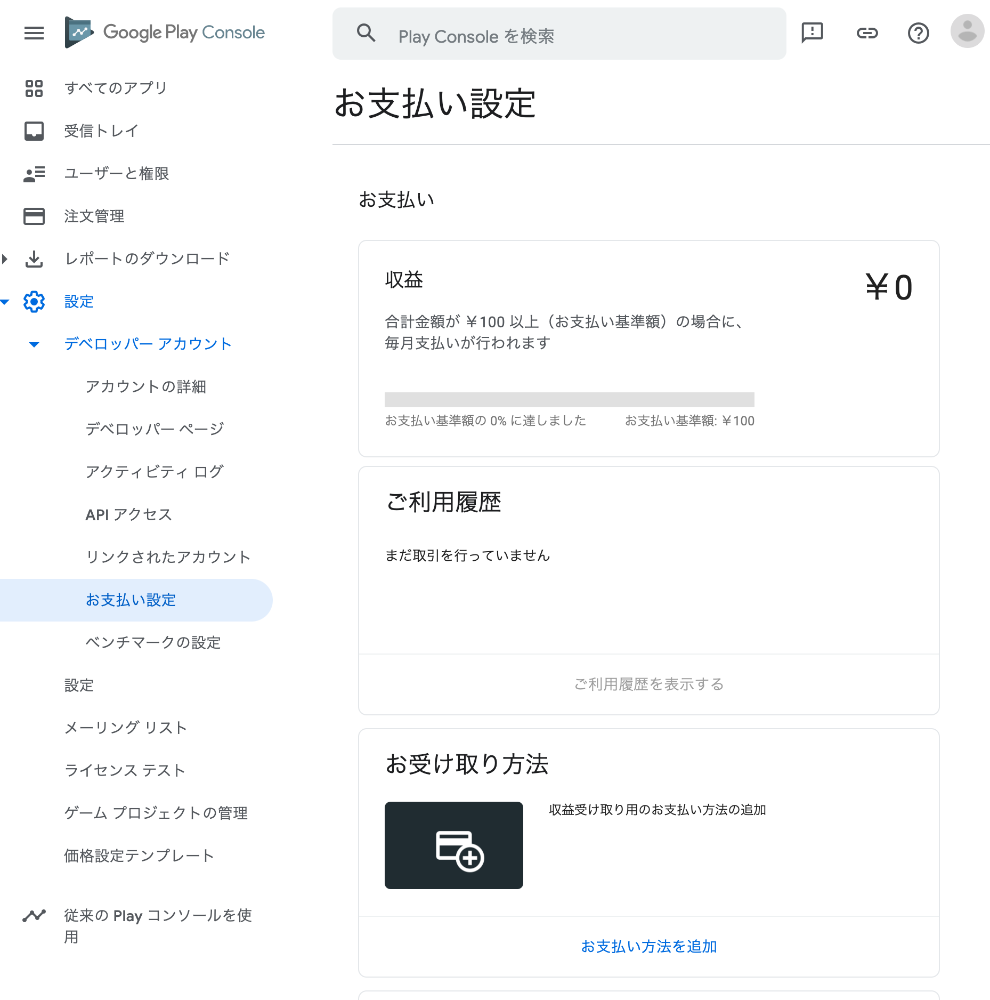

# 準備する

## Google Play デベロッパーアカウントを設定する

Google Play Console で支払いプロファイルを設定する。

まず、プロファイル作成直前の画面が以下。


「お支払いプロファイルを作成」を押すと、設定画面に遷移する。





個人のお支払いプロファイルに紐付けるかこのために新しく作るかや、会社なのか個人なのかといった設定項目がある。

設定を完了すると以下の画面に遷移する。



## Google Play Console で請求関連の機能を有効にする

### ライブラリへの依存関係を追加する

```groovy
dependencies {
    def billing_version = "3.0.0"

    implementation 'com.android.billingclient:billing-ktx:$billing_version'
}
```

### アプリをアップロードする

#### リリースビルドの作成

Android App Bundle （AAB）でリリースビルドを作る。

```bash
$ ./gradlew clean
$ ./gradlew bundleRelease
```

`app/build/outputs/bundle/release` に `app-release.aab` が生成されるのでこれを使う。 

#### ストア掲載情報の設定

- 説明文（短いものと長いもの）
- アプリアイコン
- アプリ画像（スマホ/7インチタブレット/10インチタブレットのいずれか2枚）

#### アプリ価格の設定

無料を指定するか、適当な有料の値を指定するかする。