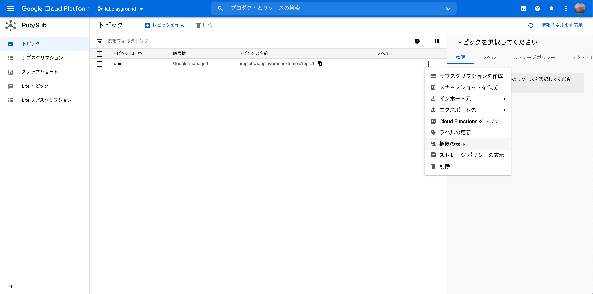

# 準備する

## Google Play デベロッパーアカウントを設定する

Google Play Console で支払いプロファイルを設定する。

まず、プロファイル作成直前の画面が以下。


「お支払いプロファイルを作成」を押すと、設定画面に遷移する。


個人のお支払いプロファイルに紐付けるかこのために新しく作るかや、会社なのか個人なのかといった設定項目がある。

設定を完了すると以下の画面に遷移する。


## Google Play Console で請求関連の機能を有効にする

### ライブラリへの依存関係を追加する

```groovy
dependencies {
    def billing_version = "3.0.0"

    implementation "com.android.billingclient:billing-ktx:$billing_version"
}
```

### アプリをアップロードする

#### リリースビルドの作成

Android App Bundle （AAB）でリリースビルドを作る。

```bash
$ ./gradlew clean
$ ./gradlew bundleRelease
```

`app/build/outputs/bundle/release` に `app-release.aab` が生成されるのでこれを使う。 

#### ストア掲載情報の設定

- 説明文（短いものと長いもの）
- アプリアイコン
- アプリ画像（スマホ/7インチタブレット/10インチタブレットのいずれか2枚）

#### アプリ価格の設定

無料を指定するか、適当な有料の値を指定するかする。

## アイテムを作成して構成する

### 管理対象アイテムの作成

[管理対象アイテムの作成](https://support.google.com/googleplay/android-developer/answer/1153481) をもとにアイテムを作る。
ただし、Google Play Console がアップデートされたことに日本語ドキュメントは追従できていない。

#### アプリの設定

Android Manifest に `com.android.vending.BILLING` が必要。

#### Play の設定

Google Play Console の 収益化 > 商品 > アプリ内サービスを表示する。
右上あたりのメニューから「アイテムを作成」を押下する。


それから必要な項目を埋める。


作成後、リストに反映される。


### 定期購入の作成

[定期購入の作成](https://support.google.com/googleplay/android-developer/answer/140504?hl=ja&ref_topic=3452890) をもとに定期購入を作る。
ただし、 Google Play Console がアップデートされたことに日本語ドキュメントは追従できていない。

#### アプリの設定

TBD: 実装次第追記

#### Play の設定

Google Play Console の収益化 > 商品 > 定期購入を表示する。
「定期購入を作成」を押下する。


それから必要な項目を埋める。


作成後、リストに反映される。


### その他

管理対象アイテムも定期購入も、有効・無効という設定がある。
編集ページから切り替えることができる。

## Google Play Developer API を構成する

[Google Play Developer API](https://developers.google.com/android-publisher/getting_started) を利用して Purchases.products や Purchases.subscriptions といった課金周りの操作をAPI経由でできるようだ。
詳しくは実装後。

## リアルタイムデベロッパー通知を構成する

### Cloud Pub/Subを設定する

GCP プロジェクトを新しく作る（または既存のものを利用する）。


### トピックを作成する

GCP プロジェクト内でトピックを作成する。

（要確認）おそらく、アプリに対して1つトピックがあればよさそう。


### トピックへのパブリッシュ権限を付与する

先程作成したトピックの権限を表示する。


トピックに `google-play-developer-notifications@system.gserviceaccount.com` というサービスアカウントを追加する。
ロールは `Pub/Subパブリッシャー` とする。


「保存」して追加されていることを確認する。


### アプリでリアルタイムデベロッパー通知を有効にする

Google Play Console から GCP への繋ぎ込みを行う。

Google Play Console の収益化＞収益化のセットアップを開く。
表示される画面に先程作成したトピックのトピック名を入力する。


「テスト通知を送信する」を押下すると、正しいトピックに送信できているかどうかがわかる。

|成功例|失敗例|
|:--|:--|
|||

成功したら「変更を保存」を押下する。