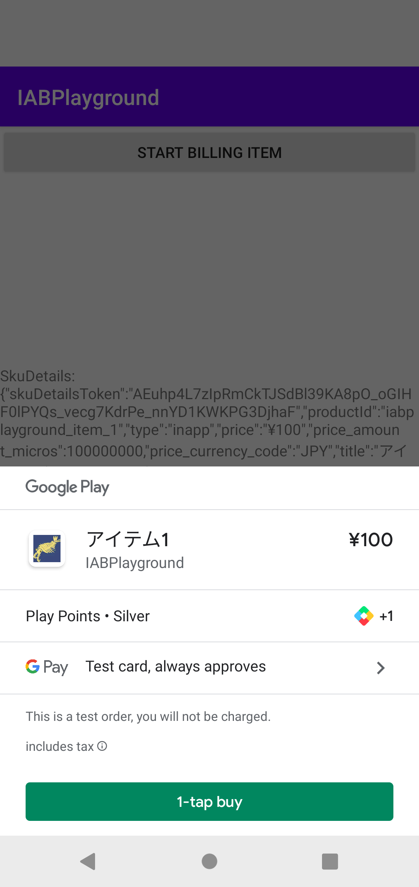

# Google Play Billing Library をアプリに統合する

## 購入ライフサイクル

TBD

## 購入トークンとオーダーID

TBD

## エラー処理

TBD

## Google Play に接続する

エミュレーターで動作確認するときは、 Google Play アプリが端末に入っていること＋Play にログインしていることが必要。
これをしない場合、「Play In-app Billing ライブラリのバージョンが古い」といったエラーメッセージがでる。

## Google Play Billing Library への依存関係を追加する

書いてあるとおりのライブラリを導入する。

## BillingClient を初期化する

[BillingClient](https://developer.android.com/reference/com/android/billingclient/api/BillingClient) の newBuilder を使う。

## Google Play との接続を確立する

BillingClient.startConnection(BillingClientStateListener) を最初に呼び出す。

## 購入可能なアイテムを表示する

BillingClient.querySkuDetailsAsync を利用する。
呼び出しの前には BillingClient.startConnection(BillingClientStateListener) を呼び出し、 BillingClientStateListener.onBillingSetupFinished まで進んでいる必要がある。

## 購入フローを起動する

BillingClient.launchBillingFlow(Activity, BillingFlowParams) を呼び出す。

実際に手元で確認するときには、以下の手順が必要かもしれない（しない場合、課金のダイアログは開くが `the item you requested is not available for purchase` とエラーが出て課金できない）。

- 内部テスト・トラック等にテスターとしてメールアドレスを登録する
- (内部テストにアップロードしたアプリのパッケージ名が動作確認しようとしているアプリのパッケージ名と同じである？)
    - [StackOverflow](https://stackoverflow.com/questions/13117081/the-item-you-requested-is-not-available-for-purchase) で「署名付きのビルドをすること」などと書いてあるが、そこまでしなくてもアイテムを表示できた
- テスターとして登録したメールアドレスで Google Play および Chrome にログインする

テスト購入では実際には課金されない。

メールに記載されている Order number と Purchase.orderId が一致する。
Order number をインデックスとして払い戻し対応等を行う。

## Appendix

- [公式サンプルGitHubプロジェクト](https://github.com/android/play-billing-samples)
